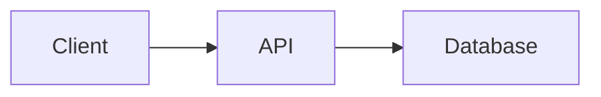

# LLMHub Documentation

This directory contains the complete documentation for LLMHub, built with [Mintlify](https://mintlify.com).

## Documentation Structure

```
docs/
├── mint.json                       # Mintlify configuration
├── introduction.mdx                # Overview and getting started
├── quickstart.mdx                  # 5-minute setup guide
├── features.mdx                    # Complete feature list
├── architecture.mdx                # Technical architecture
├── api-reference/
│   ├── overview.mdx               # API documentation overview
│   ├── authentication.mdx         # Auth guide (to be created)
│   ├── content-generation.mdx     # Content endpoints (to be created)
│   ├── image-generation.mdx       # Image endpoints (to be created)
│   ├── templates.mdx              # Template endpoints (to be created)
│   └── admin.mdx                  # Admin endpoints (to be created)
├── user-guide/
│   ├── web-console.mdx            # Web UI guide (to be created)
│   ├── api-clients.mdx            # Managing clients (to be created)
│   ├── providers.mdx              # Provider configuration (to be created)
│   ├── templates.mdx              # Template management (to be created)
│   └── billing.mdx                # Billing analytics (to be created)
├── developers/
│   ├── overview.mdx               # Developer intro (to be created)
│   ├── local-development.mdx      # Dev environment setup (to be created)
│   ├── project-structure.mdx      # Codebase tour (to be created)
│   ├── database-schema.mdx        # Database details (to be created)
│   ├── adding-providers.mdx       # Add new LLM providers (to be created)
│   └── frontend-development.mdx   # Web UI development (to be created)
├── deployment/
│   ├── overview.mdx               # Deployment guide
│   ├── docker.mdx                 # Docker setup (to be created)
│   ├── environment-variables.mdx  # Configuration reference (to be created)
│   ├── production.mdx             # Production best practices (to be created)
│   └── monitoring.mdx             # Monitoring & logging (to be created)
└── reference/
    ├── cost-tracking.mdx          # Cost calculation details (to be created)
    ├── error-codes.mdx            # Error reference (to be created)
    └── changelog.mdx              # Version history (to be created)
```

## Viewing Documentation Locally

### Option 1: Mintlify CLI (Recommended)

Install the Mintlify CLI:

```bash
npm i -g mintlify
```

Navigate to the docs directory and start the development server:

```bash
cd docs
mintlify dev
```

The documentation will be available at `http://localhost:3000`.

### Option 2: Deploy to Mintlify

1. Sign up at [mintlify.com](https://mintlify.com)
2. Connect your GitHub repository
3. Mintlify will automatically deploy your docs
4. Get a custom domain: `your-project.mintlify.app`

## Documentation Guidelines

### File Structure

All documentation files use MDX format (Markdown with JSX components).

**File naming:**
- Use kebab-case: `api-reference.mdx`
- Match the path in `mint.json` navigation

**Front matter:**
```mdx
---
title: 'Page Title'
description: 'Brief description for SEO'
---
```

### Mintlify Components

Mintlify provides rich components for documentation:

#### Cards

```mdx
<Card title="Feature Name" icon="icon-name" href="/link">
  Description text
</Card>

<CardGroup cols={2}>
  <Card title="Card 1" icon="check">Content</Card>
  <Card title="Card 2" icon="star">Content</Card>
</CardGroup>
```

#### Code Blocks

```mdx
<CodeGroup>

\`\`\`python Python
print("Hello World")
\`\`\`

\`\`\`javascript JavaScript
console.log("Hello World");
\`\`\`

</CodeGroup>
```

#### Callouts

```mdx
<Note>
  This is a note callout
</Note>

<Warning>
  This is a warning callout
</Warning>

<Tip>
  This is a tip callout
</Tip>

<Info>
  This is an info callout
</Info>
```

#### Accordions

```mdx
<AccordionGroup>
  <Accordion title="Question 1">
    Answer 1
  </Accordion>
  <Accordion title="Question 2">
    Answer 2
  </Accordion>
</AccordionGroup>
```

#### Tabs

```mdx
<Tabs>
  <Tab title="Option 1">
    Content for tab 1
  </Tab>
  <Tab title="Option 2">
    Content for tab 2
  </Tab>
</Tabs>
```

#### Steps

```mdx
<Steps>
  <Step title="First Step">
    Instructions for step 1
  </Step>
  <Step title="Second Step">
    Instructions for step 2
  </Step>
</Steps>
```

### Mermaid Diagrams

Mintlify supports Mermaid for diagrams:



### Icons

Use Font Awesome icons in components:

```mdx
<Card icon="rocket" iconType="duotone">
```

Available icon types:
- `solid` (default)
- `regular`
- `duotone`
- `brand`

Browse icons: [fontawesome.com/icons](https://fontawesome.com/icons)

## Contributing to Documentation

### Adding New Pages

1. Create MDX file in appropriate directory
2. Add front matter with title and description
3. Update `mint.json` navigation to include new page
4. Test locally with `mintlify dev`
5. Submit pull request

### Updating Existing Pages

1. Edit the MDX file
2. Preview changes locally
3. Ensure all links work
4. Submit pull request

### Documentation Standards

- **Be concise**: Get to the point quickly
- **Use examples**: Show code samples for API endpoints
- **Add visuals**: Include diagrams, screenshots, or charts
- **Link related content**: Help users discover related topics
- **Test code samples**: Ensure all examples work
- **Update regularly**: Keep docs in sync with code changes

## Customization

### Theme & Styling

Edit `mint.json` to customize:

```json
{
  "colors": {
    "primary": "#7C3AED",
    "light": "#A78BFA",
    "dark": "#6D28D9"
  },
  "theme": "mint"
}
```

Available themes:
- `mint` (default)
- `maple`
- `palm`
- `linden`
- `willow`
- `sage`
- `oak`
- `chestnut`
- `kernel`
- `almond`

### Navigation

Edit `mint.json` navigation section to add/remove/reorder pages:

```json
{
  "navigation": [
    {
      "group": "Getting Started",
      "pages": [
        "introduction",
        "quickstart"
      ]
    }
  ]
}
```

### Logo & Branding

Add your logo files to `docs/logo/`:
- `light.svg` - Logo for light mode
- `dark.svg` - Logo for dark mode

Update `mint.json`:

```json
{
  "logo": {
    "dark": "/logo/dark.svg",
    "light": "/logo/light.svg"
  },
  "favicon": "/favicon.svg"
}
```

## Resources

- **Mintlify Docs**: https://mintlify.com/docs
- **Mintlify GitHub**: https://github.com/mintlify
- **MDX Documentation**: https://mdxjs.com/
- **Font Awesome Icons**: https://fontawesome.com/icons
- **Mermaid Diagrams**: https://mermaid.js.org/

## Support

- **Issues**: Report documentation issues on GitHub
- **Questions**: Ask in GitHub Discussions
- **Contributions**: Submit pull requests for improvements

## License

Documentation is licensed under the same license as LLMHub.
