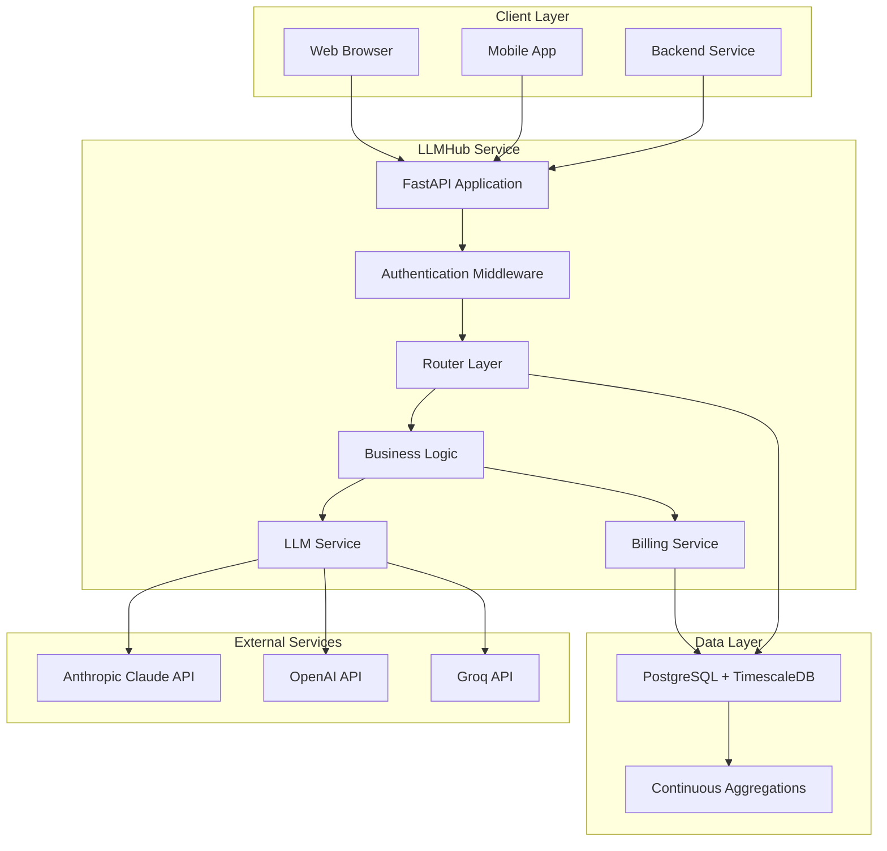
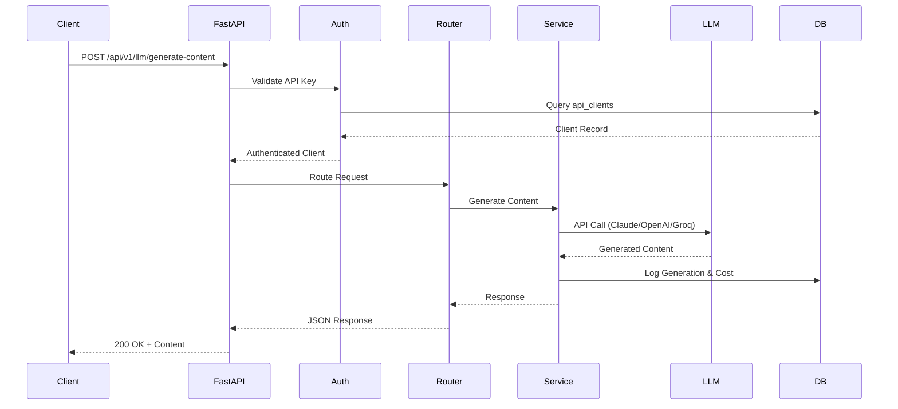

## System Overview

LLMHub is built as a **microservice** architecture with clear separation of concerns between API layer, business logic, data storage, and frontend.



## Technology Stack

### Backend

<CardGroup cols={2}>
  <Card title="FastAPI" icon="bolt" iconType="duotone">
    Modern Python web framework with automatic OpenAPI docs
  </Card>
  <Card title="Pydantic" icon="shield-check" iconType="duotone">
    Data validation and settings management
  </Card>
  <Card title="SQLAlchemy" icon="database" iconType="duotone">
    ORM for type-safe database operations
  </Card>
  <Card title="Structlog" icon="file-lines" iconType="duotone">
    Structured logging for observability
  </Card>
</CardGroup>

### Database

- **PostgreSQL 15**: Reliable, feature-rich relational database
- **TimescaleDB Extension**: Time-series optimization with automatic partitioning
- **Continuous Aggregations**: Real-time materialized views for cost analytics

### Frontend

- **Preact**: Lightweight 3KB React alternative
- **Vite 7**: Next-generation frontend tooling
- **Tailwind CSS**: Utility-first CSS framework
- **Axios**: HTTP client for API communication

### Infrastructure

- **Docker**: Containerization for consistent deployments
- **Docker Compose**: Multi-container orchestration
- **Nginx** (optional): Reverse proxy for production

## Application Architecture

### Request Flow



### Directory Structure

```
llmhub/
├── src/
│   ├── main.py                  # FastAPI app initialization
│   ├── config/
│   │   ├── settings.py         # Pydantic settings
│   │   └── database.py         # SQLAlchemy setup
│   ├── models/
│   │   ├── database.py         # ORM models
│   │   └── schemas.py          # Pydantic request/response schemas
│   ├── routers/
│   │   ├── content.py          # Content generation endpoints
│   │   ├── images.py           # Image generation endpoints
│   │   ├── prompts.py          # Template CRUD
│   │   ├── billing.py          # Billing reports
│   │   └── admin.py            # Admin API for web UI
│   ├── services/
│   │   ├── llm_core.py         # Multi-provider LLM logic
│   │   ├── auth.py             # Authentication
│   │   └── billing.py          # Cost tracking
│   └── utils/
│       └── logger.py           # Structured logging
├── web-ui/                      # Preact management console
│   ├── src/
│   │   ├── main.jsx            # App entry point
│   │   ├── App.jsx             # Root component
│   │   ├── views/              # Page components
│   │   ├── api/                # API client
│   │   └── style.css           # Tailwind styles
│   └── vite.config.js          # Vite configuration
├── database/
│   └── init.sql                # Schema initialization
├── docs/                        # Mintlify documentation
└── docker-compose.yml          # Service orchestration
```

## Design Patterns

### Multi-Provider Abstraction

The `LLMCoreService` provides a unified interface for all LLM providers.

```python
class LLMCoreService:
    def call_llm(self, provider: str, model: str, prompt: str, **kwargs):
        """Unified interface for all providers"""
        if provider == "claude":
            return self._call_claude(model, prompt, **kwargs)
        elif provider == "openai":
            return self._call_openai(model, prompt, **kwargs)
        elif provider == "groq":
            return self._call_groq(model, prompt, **kwargs)

    def _call_claude(self, model: str, prompt: str, **kwargs):
        """Provider-specific implementation"""
        # Anthropic SDK integration
        # Token counting
        # Cost calculation
        return standardized_response

    # Similar methods for OpenAI and Groq
```

#### Benefits

- **Single Integration Point**: Add new providers without changing API
- **Consistent Response Format**: All providers return same structure
- **Centralized Error Handling**: Provider-specific errors mapped to common format
- **Easy Testing**: Mock single service instead of multiple SDKs

### Dependency Injection

FastAPI's dependency system provides clean authentication.

```python
from fastapi import Depends, Header

async def get_current_client(
    x_api_key: str = Header(..., alias="X-API-Key"),
    db: Session = Depends(get_db)
) -> APIClient:
    """Validate API key and inject client object"""
    client = db.query(APIClient).filter(
        APIClient.api_key == x_api_key,
        APIClient.is_active == True
    ).first()

    if not client:
        raise HTTPException(status_code=401)

    return client

# Use in routes
@router.post("/generate-content")
async def generate_content(
    request: GenerateRequest,
    client: APIClient = Depends(get_current_client)
):
    # Client is automatically injected and validated
    pass
```

### Repository Pattern (Implicit)

Services encapsulate all database operations.

```python
class BillingService:
    def __init__(self, db: Session):
        self.db = db

    def log_generation(self, client_id, provider, model, cost, ...):
        """Log LLM generation to database"""
        log_entry = LLMGenerationLog(
            client_id=client_id,
            provider=provider,
            model=model,
            cost_usd=cost,
            ...
        )
        self.db.add(log_entry)
        self.db.commit()
        return log_entry
```

## Database Design

### TimescaleDB Architecture

```sql
-- Hypertable (automatically partitioned by time)
CREATE TABLE llm_generation_log (
    log_id SERIAL,
    client_id INTEGER,
    provider VARCHAR(50),
    cost_usd DECIMAL(10,6),
    created_at TIMESTAMPTZ DEFAULT CURRENT_TIMESTAMP,
    PRIMARY KEY (log_id, created_at)  -- Required for hypertable
);

SELECT create_hypertable('llm_generation_log', 'created_at');

-- Continuous Aggregations (automatically updated)
CREATE MATERIALIZED VIEW llm_daily_costs
WITH (timescaledb.continuous) AS
SELECT
    time_bucket('1 day', created_at) AS day,
    provider,
    SUM(cost_usd) AS total_cost_usd,
    COUNT(*) AS total_calls
FROM llm_generation_log
GROUP BY day, provider;

-- Refresh policy (automatic updates)
SELECT add_continuous_aggregate_policy('llm_daily_costs',
    start_offset => INTERVAL '3 days',
    end_offset => INTERVAL '1 hour',
    schedule_interval => INTERVAL '1 hour');
```

#### Benefits

- **Automatic Partitioning**: Data organized by time for fast queries
- **Compression**: Older data automatically compressed (70-90% reduction)
- **Fast Aggregations**: Pre-computed summaries updated in real-time
- **Retention Policies**: Automatic data cleanup after 90 days

### Indexing Strategy

```sql
-- API key lookups (most frequent operation)
CREATE UNIQUE INDEX idx_api_clients_api_key ON api_clients(api_key);

-- Time-range queries
CREATE INDEX idx_generation_log_created_at ON llm_generation_log(created_at DESC);

-- Client cost tracking
CREATE INDEX idx_generation_log_client_created ON llm_generation_log(client_id, created_at DESC);

-- Provider analytics
CREATE INDEX idx_generation_log_provider ON llm_generation_log(provider);
```

## Scalability Considerations

### Horizontal Scaling

LLMHub is **stateless** and can scale horizontally:

```yaml
# docker-compose production
services:
  llmhub-api-1:
    image: llmhub:latest
    environment:
      - DATABASE_URL=postgresql://...

  llmhub-api-2:
    image: llmhub:latest
    environment:
      - DATABASE_URL=postgresql://...

  nginx:
    image: nginx:alpine
    # Load balancer configuration
```

### Database Optimization

- **Connection Pooling**: SQLAlchemy manages connection pool (default: 5-20 connections)
- **Query Optimization**: All queries use indexes
- **Read Replicas**: PostgreSQL replication for read-heavy workloads
- **Caching Layer**: Redis for frequently accessed data (future enhancement)

### Cost Tracking Performance

TimescaleDB handles millions of rows efficiently:

- **Write Performance**: ~10,000 inserts/second per node
- **Aggregation Performance**: Continuous aggregations pre-compute results
- **Query Performance**: Time-range queries leverage partitioning

## Security Architecture

### Authentication Flow

1. Client includes `X-API-Key` header
2. Middleware extracts key before routing
3. Database lookup validates key and checks `is_active`
4. Rate limit check (future: Redis-based limiter)
5. Budget check against monthly limit
6. Request proceeds if all checks pass

### Data Security

- **API Keys**: Stored in plaintext (consider hashing for production)
- **Database Credentials**: Environment variables only
- **TLS/SSL**: Recommended for production (Nginx termination)
- **CORS**: Configurable allowed origins

## Error Handling Strategy

### Layered Error Handling

```python
# 1. Validation Layer (Pydantic)
class GenerateRequest(BaseModel):
    prompt: str = Field(..., min_length=1)
    provider: str = Field(..., pattern="^(claude|openai|groq)$")

# 2. Authentication Layer
if not client or not client.is_active:
    raise HTTPException(status_code=401, detail="Invalid API key")

# 3. Business Logic Layer
try:
    result = llm_service.call_llm(...)
except ProviderAPIError as e:
    logger.error("Provider API failed", provider=provider, error=str(e))
    raise HTTPException(status_code=502, detail="LLM provider unavailable")

# 4. Global Exception Handler
@app.exception_handler(Exception)
async def global_exception_handler(request, exc):
    logger.error("Unhandled exception", error=str(exc), path=request.url.path)
    return JSONResponse(
        status_code=500,
        content={"detail": "Internal server error"}
    )
```

## Deployment Architecture

### Development

```
┌─────────────┐
│   Docker    │
│  Compose    │
├─────────────┤
│  LLMHub API │
│  TimescaleDB│
│  Web UI     │
└─────────────┘
```

### Production (Recommended)

```
┌─────────────┐      ┌─────────────┐
│   Nginx     │─────▶│  LLMHub 1   │
│Load Balancer│      ├─────────────┤
│             │─────▶│  LLMHub 2   │
└─────────────┘      ├─────────────┤
                     │  LLMHub 3   │
                     └─────────────┘
                            │
                     ┌─────────────┐
                     │ TimescaleDB │
                     │  (Primary)  │
                     ├─────────────┤
                     │   Replica   │
                     └─────────────┘
```

## Monitoring & Observability

### Logging

All requests logged with structured data:

```json
{
  "event": "http_request",
  "method": "POST",
  "path": "/api/v1/llm/generate-content",
  "status": 200,
  "duration_ms": 1420,
  "client": "recloud_marketing",
  "provider": "claude",
  "cost_usd": 0.0024
}
```

### Metrics (Future)

- **Prometheus**: Scrape metrics from `/metrics` endpoint
- **Grafana**: Visualize request rates, latencies, costs
- **Alerts**: Budget thresholds, error rates, latency spikes

## Future Enhancements

<CardGroup cols={2}>
  <Card title="Caching Layer" icon="database">
    Redis for prompt templates and provider configurations
  </Card>
  <Card title="Async Workers" icon="gears">
    Celery for background jobs (embeddings, bulk operations)
  </Card>
  <Card title="GraphQL API" icon="diagram-project">
    Alternative to REST for flexible queries
  </Card>
  <Card title="Kubernetes" icon="cubes">
    Helm charts for cloud-native deployments
  </Card>
</CardGroup>
