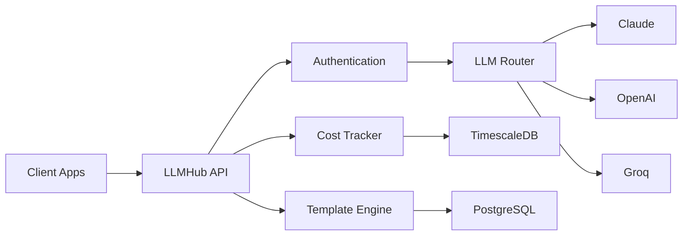

## What is LLMHub?

LLMHub is a **production-ready FastAPI microservice** that provides application-agnostic LLM capabilities with multi-provider support and comprehensive cost tracking. Built for developers who need a unified interface to interact with multiple AI providers without managing individual integrations.

<CardGroup cols={2}>
  <Card
    title="Multi-Provider Support"
    icon="layer-group"
    iconType="duotone"
  >
    Seamlessly integrate with Claude, OpenAI, and Groq from a single API
  </Card>
  <Card
    title="Cost Tracking"
    icon="chart-line"
    iconType="duotone"
  >
    Real-time billing analytics powered by TimescaleDB with automatic aggregations
  </Card>
  <Card
    title="Prompt Templates"
    icon="file-code"
    iconType="duotone"
  >
    Reusable templates with variable substitution and version history
  </Card>
  <Card
    title="Web Management Console"
    icon="browser"
    iconType="duotone"
  >
    Beautiful Preact-powered UI for managing clients, providers, and analytics
  </Card>
</CardGroup>

## Key Features

### 🚀 Production-Ready Architecture

- **FastAPI** backend with async support
- **TimescaleDB** for efficient time-series data storage
- **Docker Compose** for simple deployment
- Comprehensive error handling and logging

### 💰 Advanced Cost Tracking

- Per-request cost calculation
- Hourly, daily, and monthly aggregations
- Budget limits and usage alerts
- Cost breakdown by provider and client

### 🎯 Developer-Friendly

- OpenAPI/Swagger documentation
- Type-safe Python with Pydantic
- Simple REST API design
- Extensive integration examples

### 🔐 Enterprise-Ready Security

- API key authentication
- Rate limiting per client
- Monthly budget enforcement
- Audit logging

## Use Cases

<AccordionGroup>
  <Accordion title="Marketing Automation">
    Generate personalized marketing content across multiple languages using prompt templates and track costs per campaign.
  </Accordion>

  <Accordion title="Customer Support">
    Power chatbots and support systems with multiple LLM providers, with automatic failover and cost optimization.
  </Accordion>

  <Accordion title="Content Generation">
    Create blog posts, social media content, and product descriptions with versioned templates and A/B testing.
  </Accordion>

  <Accordion title="Development Teams">
    Centralize LLM access for your organization with per-team API keys, budget controls, and usage analytics.
  </Accordion>
</AccordionGroup>

## Architecture Overview



## Quick Example

```python
import requests

# Generate content with Claude
response = requests.post(
    'http://localhost:4000/api/v1/llm/generate-content',
    headers={'X-API-Key': 'your-api-key'},
    json={
        'prompt': 'Write a product description for eco-friendly water bottle',
        'languages': ['en'],
        'provider': 'claude',
        'model': 'claude-3-5-sonnet-20241022'
    }
)

result = response.json()
print(result['content'])  # Generated text
print(f"Cost: ${result['cost_usd']}")  # 0.0024
```

## What's Next?

<CardGroup cols={2}>
  <Card
    title="Quickstart"
    icon="rocket"
    href="/quickstart"
  >
    Get LLMHub running in 5 minutes with Docker Compose
  </Card>
  <Card
    title="API Reference"
    icon="code"
    href="/api-reference/overview"
  >
    Explore the complete API documentation
  </Card>
  <Card
    title="Deploy to Production"
    icon="server"
    href="/deployment/overview"
  >
    Learn how to deploy LLMHub to production
  </Card>
  <Card
    title="Developer Guide"
    icon="screwdriver-wrench"
    href="/developers/overview"
  >
    Extend LLMHub with custom providers and features
  </Card>
</CardGroup>
